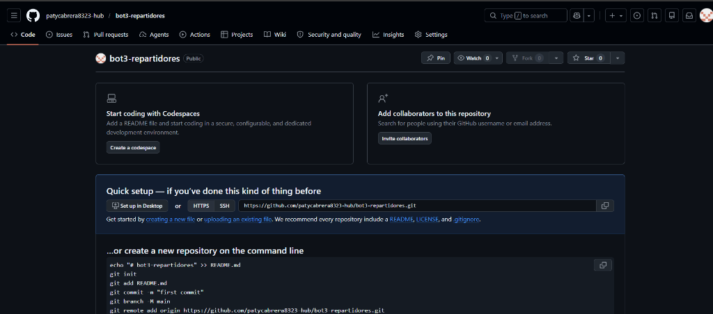

# 🛵 Tu Colonia en un Click — Panel Repartidor

> Panel de despacho y seguimiento de pedidos en tiempo real para repartidores de **Tu Colonia en un Click**.



## ✨ Características

- ✅ Login con verificación de rol (repartidor / admin / owner)
- ✅ Tablero Kanban en 3 columnas: **Pendientes → En Ruta → Entregados**
- ✅ Actualización en tiempo real vía Firebase Firestore
- ✅ Avance de estado de pedidos con un solo clic
- ✅ 🔔 Sonido de notificación + alerta del navegador para pedidos nuevos
- ✅ Filtro por negocio (para admins multi-negocio)
- ✅ Conectado a Firebase Firestore (proyecto: bot-nuevo-bdf67)
- ✅ Diseño premium: dark mode, glassmorphism, cyan neon

## 🚀 Uso local

```bash
npm install
npm start
# Abre http://localhost:3002
```

## 🔑 Credenciales de prueba (modo local sin Firebase)

| Usuario | Correo | Contraseña |
|---------|--------|------------|
| Repartidor | `reparto@tucolonia.com` | `reparto123` |
| Admin | `admin@tucolonia.com` | `admin123` |

## ☁️ Despliegue

Este proyecto se puede desplegar en **Cloudflare Pages** o **Firebase Hosting** como sitio estático.

- **Framework preset**: None
- **Build command**: *(vacío)*
- **Build output directory**: *(vacío)*

El archivo `server.js` sirve para pruebas locales únicamente.

## 🔗 Proyecto relacionado

- 🏪 [Panel Admin de Negocios](https://github.com/patycabrera8323-hub/bot3admin)
- 🤖 Bot de WhatsApp: proyecto `bot-nuevo-bdf67` en Firebase
